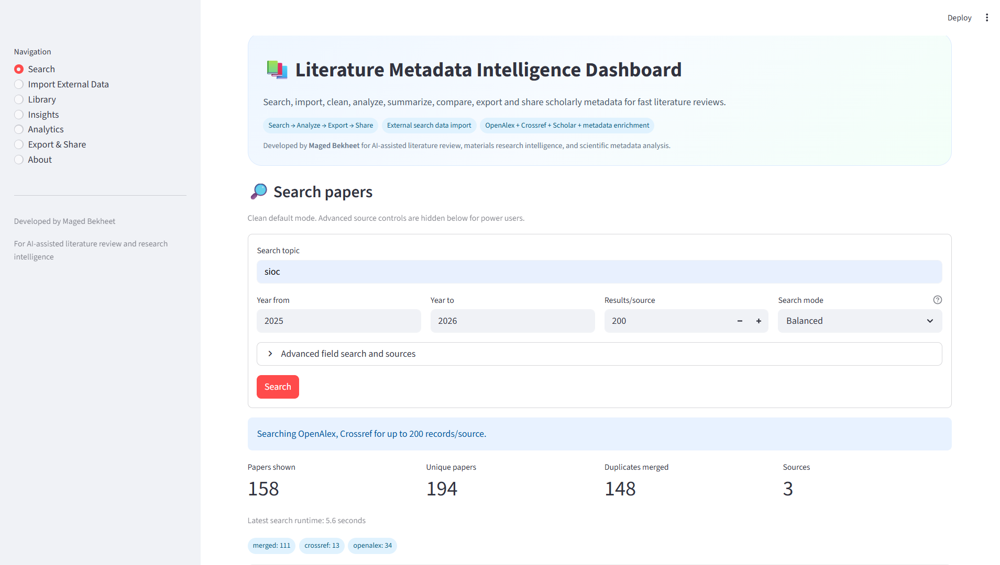
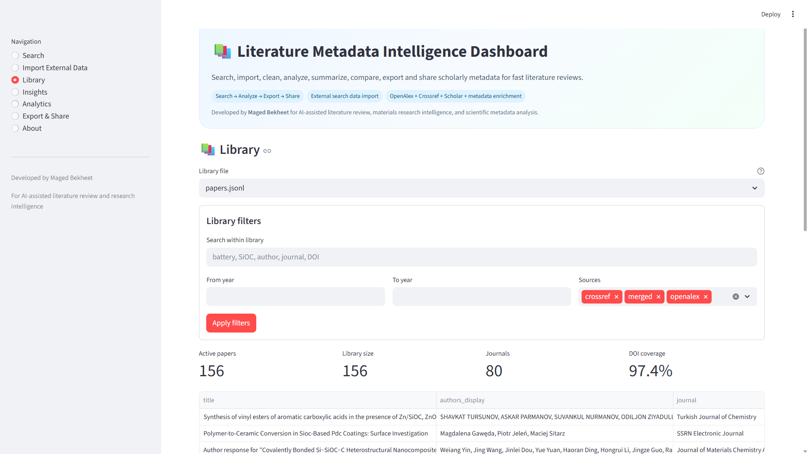
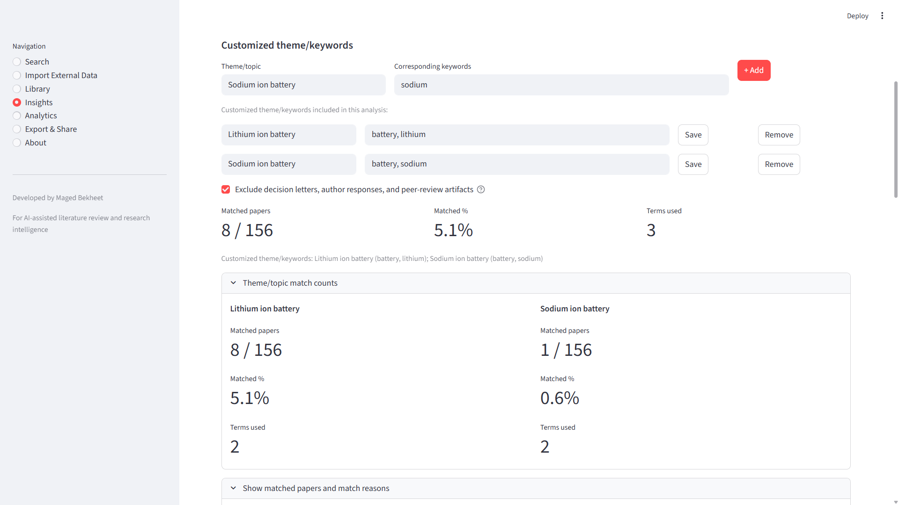
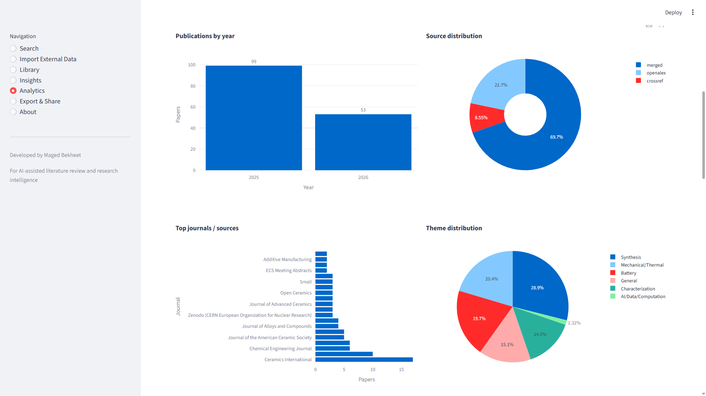
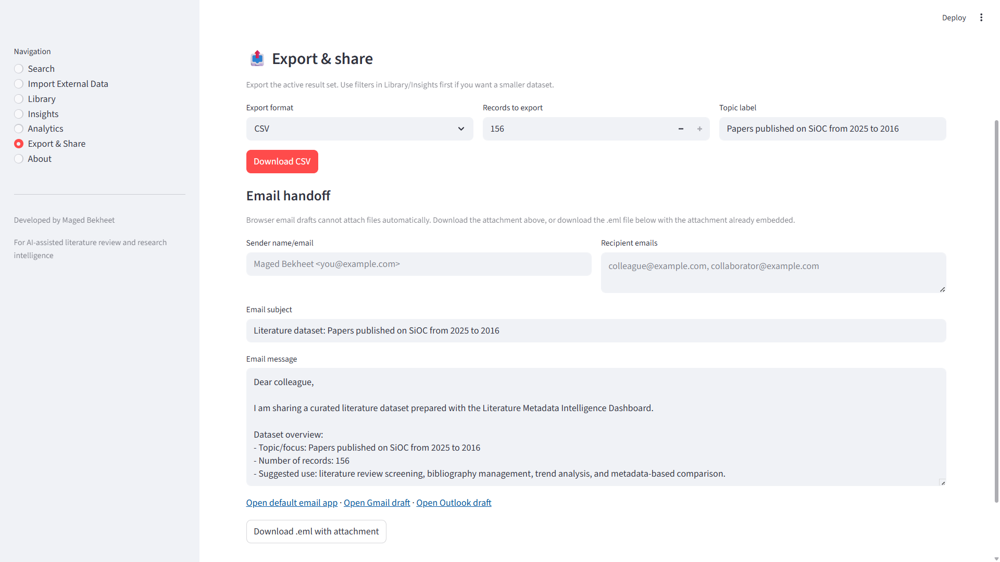

# Literature Metadata Intelligence Dashboard

A Streamlit dashboard for interactive scientific literature review from scholarly metadata. It helps you search, import, deduplicate, enrich, analyze, summarize, compare, export, and share literature records without needing a full PDF/RAG pipeline for the first screening pass.

This project is the interactive analysis layer for literature metadata. It pairs naturally with the companion automation project:

[magedbekheet/ai-literature-feed-automation](https://github.com/magedbekheet/ai-literature-feed-automation)

## Why This Exists

Literature search often produces messy records from OpenAlex, Crossref, Google Scholar-derived files, Zotero, Scopus, Web of Science, ScienceDirect, and custom automation scripts. This dashboard turns those records into a cleaner review workspace:

```text
Search or import -> deduplicate -> enrich metadata -> analyze themes -> summarize -> compare -> export/share
```

## Screenshots

### Search



### Library Enrichment



### Insights And Custom Themes



### Analytics



### Export And Share



See [docs/SCREENSHOTS.md](docs/SCREENSHOTS.md) for recapturing guidance.

## Features

- Search scholarly metadata from OpenAlex and Crossref.
- Optional Google Scholar local / SerpAPI and Semantic Scholar sources, with conservative limits for rate-limited APIs.
- Import JSON, JSONL, CSV, BibTeX, and RIS files.
- Deduplicate by DOI, normalized title, year, and author overlap.
- Library-only metadata enrichment with Fast, Balanced, and Deep modes.
- Exclude decision letters, author responses, referee reports, and peer-review artifacts from analysis by default while keeping them in the library.
- Built-in theme analysis with multiple selectable themes.
- Customized theme/keywords builder with add, edit, remove, per-theme counts, and matched-paper reasons.
- Rank top papers by relevance, hybrid score, citations, recency, metadata completeness, or current order.
- Analytics for publication year, source, journal, theme, metadata completeness, keywords, relevance, and relevance-vs-citation comparisons.
- Narrative literature review export with numbered citation markers and references.
- Optional local Ollama polishing for narrative reviews.
- Export CSV, JSON, BibTeX, RIS, Markdown, review briefs, and `.eml` email handoff files.
- Multiple-recipient email draft links for default email apps, Gmail, and Outlook.

## Companion Project Integration

This dashboard is designed to consume outputs from:

[magedbekheet/ai-literature-feed-automation](https://github.com/magedbekheet/ai-literature-feed-automation)

Recommended two-project workflow:

```text
ai-literature-feed-automation
  -> scheduled search feeds
  -> JSONL / BibTeX / RIS / digest outputs
  -> import into this dashboard
  -> curate, enrich, analyze, summarize, and export
```

See [docs/COMPANION_WORKFLOW.md](docs/COMPANION_WORKFLOW.md) for details.

Supported companion outputs include:

```text
data/feeds/papers.jsonl
data/bibtex/selected_papers.bib
data/ris/selected_papers.ris
data/digests/latest_digest.md
```

## Installation

```bash
python -m venv .venv
source .venv/bin/activate
pip install -r requirements.txt
streamlit run app.py
```

On Windows:

```powershell
py -m venv .venv
.\.venv\Scripts\Activate.ps1
py -m pip install -r requirements.txt
streamlit run app.py
```

## Optional Environment Variables

Create a `.env` file if needed:

```env
OPENALEX_MAILTO=your_email@example.com
OPENALEX_API_KEY=your_openalex_api_key
UNPAYWALL_EMAIL=your_email@example.com
SERPAPI_KEY=your_serpapi_key
ELSEVIER_API_KEY=your_elsevier_api_key
SEMANTIC_SCHOLAR_API_KEY=your_semantic_scholar_api_key
```

## Metadata Sources

```text
OpenAlex = primary large-scale scholarly metadata backend
Crossref = DOI and journal metadata
Google Scholar = optional broad discovery/enrichment; may be rate-limited
Semantic Scholar = optional citation/abstract search/enrichment; best with API key
arXiv = optional preprint source
Unpaywall = optional open-access/PDF metadata enrichment
Elsevier = optional ScienceDirect enrichment when an API key is available
```

Google Scholar local access uses the `scholarly` package and can be fragile because Google Scholar may rate-limit or show CAPTCHA. SerpAPI is more stable if you have a key.

For deployed apps, set `OPENALEX_MAILTO` and `OPENALEX_API_KEY` in Streamlit secrets. OpenAlex documents much tighter unauthenticated limits and free API keys for production use. The app includes `mailto`, `api_key`, light throttling, and clearer HTTP `429` messages when configured.

Semantic Scholar can be used without a key, but anonymous requests are rate-limited and may return HTTP `429`. For reliable use, request a free Semantic Scholar API key and set:

```env
SEMANTIC_SCHOLAR_API_KEY=your_semantic_scholar_api_key
```

The app respects Semantic Scholar's introductory limit of about **1 request/second**. Recommended Semantic Scholar search limits are:

```text
10 records = normal searches
20-25 records = broader checks
50 records = maximum; can be slow and may trigger rate limits if repeated
```

OpenAlex and Crossref are recommended as the primary search sources. Use Semantic Scholar mainly for citation counts, abstracts, and selected metadata enrichment when extra coverage is needed.

## Import Schema

Recommended metadata schema:

```json
{
  "title": "",
  "authors": [],
  "abstract": "",
  "journal": "",
  "year": "",
  "doi": "",
  "url": "",
  "source": "",
  "keywords": [],
  "pdf_url": "",
  "citation_count": 0
}
```

## Enrichment Modes

Metadata enrichment is available from the Library page after saving or importing records.

| Mode | Sources | Best use |
| --- | --- | --- |
| Fast | Crossref + OpenAlex | First pass, fastest workflow |
| Balanced | Crossref + OpenAlex + Unpaywall | Adds OA/PDF metadata |
| Deep | Crossref + OpenAlex + Unpaywall + Semantic Scholar + optional Elsevier/publisher pages | Best for selected missing metadata; slowest |

Recommended fast settings:

```text
Enrichment mode: Fast
Records to enrich: 10-20
Only rows with missing metadata: checked
Try publisher URL: off
```

Use Deep mode on modest batches when records still need abstracts, citation counts, or PDF links. Semantic Scholar enrichment uses the API key when available and is throttled to about 1 request/second.

## Analysis Scope

The dashboard supports three analysis scopes:

```text
All papers
By theme
Customized theme/keywords
```

### By Theme

You can select one or several built-in themes:

```python
THEME_TERMS = {
    "Battery": ["battery", "batteries", "lithium", "sodium", "anode", "cathode", "capacity", "electrochemical", "cycling"],
    "Synthesis": ["synthesis", "prepared", "fabricated", "pyrolysis", "precursor", "sol-gel", "annealing", "crosslinking", "polymerization", "hydrothermal", "autoclave"],
    "Characterization": ["xrd", "raman", "sem", "tem", "xps", "ftir", "nmr", "spectroscopy", "elemental analysis"],
    "Mechanical/Thermal": ["mechanical", "hardness", "modulus", "thermal", "oxidation", "strength"],
    "AI/Data/Computation": ["machine learning", "artificial intelligence", "deep learning", "dft", "computing", "computation", "python", "simulation"],
}
```

### Customized Theme/Keywords

Add several theme/topic entries, each with its own keywords:

```text
Battery performance: capacity, cycling, retention, rate capability
Synthesis route: pyrolysis, sol-gel, annealing, precursor
Characterization: xrd, raman, sem, tem, xps
```

Each theme gets:

- Matched paper count.
- Matched percentage.
- Terms used.
- Matched-paper reasons.
- Theme dropdown filtering in the match report.

## Ranking

Top papers for summaries and comparison tables can be ranked by:

```text
Relevance to theme/keywords
Hybrid relevance + citations + recency
Citation count
Newest first
Metadata completeness
Current order
```

The default is **Relevance to theme/keywords**. Hybrid ranking combines normalized relevance, citation count, publication year, and metadata completeness.

## Narrative Reviews And AI Polishing

Insights can export a continuous Markdown narrative review with numbered citation markers such as `[1]`, `[2]`, and a matching references section.

If Ollama is installed and running locally, the narrative can optionally be polished with a local model. The default fast model is:

```text
llama3.2:3b
```

For stronger but slower prose, try:

```text
qwen2.5:7b
```

The app can load installed Ollama models into a dropdown. OpenAI and Gemini are listed as future paid-API polishing options, but local Ollama is the only connected AI provider in this version.

## Validation

```bash
python smoke_test.py
python -m unittest discover -s tests
python -m compileall app.py app smoke_test.py tests
```

On Windows, replace `python` with `py` if needed.

## Repository Notes

Ignored local artifacts include:

- `.env`
- virtual environments
- Python cache files
- local library JSONL files
- exports/uploads/PDF/vector stores

The app creates local storage folders under `storage/`; sample placeholder files are kept so the folder structure exists in a fresh clone.

## License, Disclaimer, And Liability

This project is distributed under the MIT License. See the repository [LICENSE](LICENSE) file.

This software is provided for research support, metadata exploration, literature screening, and workflow assistance. It is not a substitute for expert scientific judgment, formal systematic-review methodology, legal advice, medical advice, or professional decision-making.

The app relies on third-party scholarly metadata providers and optional local or external AI tools. Search results, metadata enrichment, citation counts, abstracts, links, AI-polished summaries, and exported review text may be incomplete, outdated, inaccurate, duplicated, or unavailable depending on source coverage, API behavior, rate limits, user configuration, and local model behavior.

Users are responsible for verifying all bibliographic records, DOI links, citations, summaries, exported files, and interpretations before using them in publications, reports, grant applications, clinical work, legal work, or other high-stakes contexts.

To the maximum extent permitted by the applicable license and law, the author and contributors are not liable for losses, damages, errors, omissions, or decisions arising from use of this software or generated outputs.

## Documentation

- [Development](docs/DEVELOPMENT.md)
- [Screenshots](docs/SCREENSHOTS.md)
- [Companion automation workflow](docs/COMPANION_WORKFLOW.md)

## Author

Developed by **Maged Bekheet** for AI-assisted literature review, materials research intelligence, and scientific metadata analysis.
